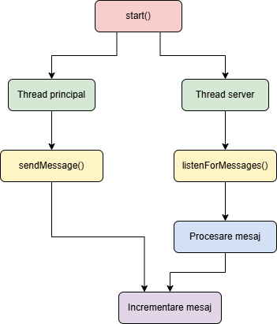
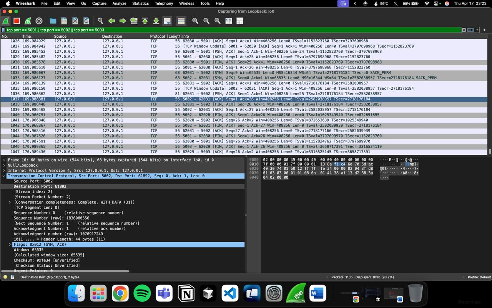
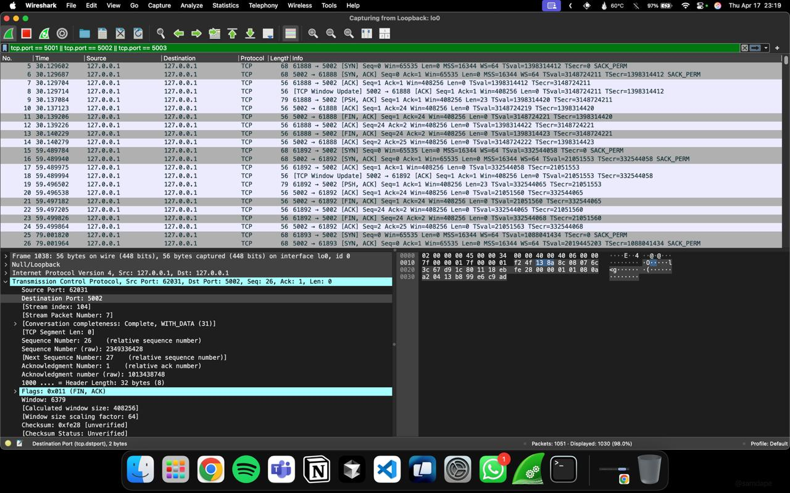
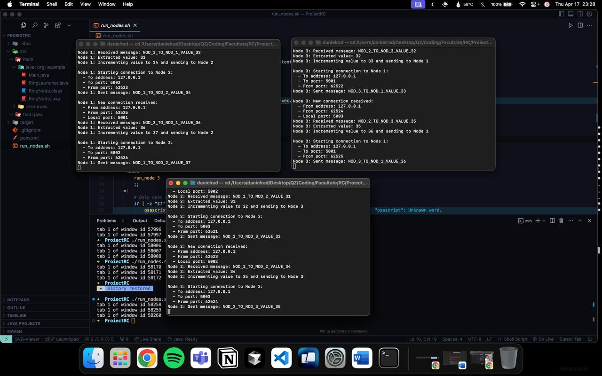

# 🔄 Ring Communication Implementation

## 📝 Description

This project implements a ring network topology where three nodes communicate in a unidirectional manner, forming a loop. The implementation meets the following requirements:

- Three computers communicate in one direction, creating a loop
- One computer initiates communication by sending the value '1'
- Upon receiving, each network device increments the received value and sends it to the next device
- Communication ends when the delivered payload reaches the value '100'

## 🏗️ Implementation Details

The implementation follows these specifications:

- **Code reuse**: A single `RingNode` class is instantiated 3 times with different communication parameters
- **Communication**: Uses TCP sockets
- **Addressing**: Uses the loopback address range (127.0.0.1)
- **Message format**: `NOD_X_TO_NOD_Y_VALUE_Z` for better identification in Wireshark

## 🌐 Node Structure

| Node | Listening on | Sends to | Role |
|------|--------------|----------|------|
| 1 | 127.0.0.1:5001 | 127.0.0.1:5002 | Initiator |
| 2 | 127.0.0.1:5002 | 127.0.0.1:5003 | Intermediary |
| 3 | 127.0.0.1:5003 | 127.0.0.1:5001 | Intermediary |

## 🧵 Multithreading Approach

Threads are essential in this implementation for:

1. **Deadlock avoidance**:
   - Without threads, a node would wait for a message and never be able to send one

2. **Simultaneous operations**:
   - Each node must simultaneously:
     - Listen for messages (secondary thread)
     - Send messages (main thread)

3. **Server-Client model**:
   - The secondary thread implements server behavior (`listenForMessages()`)
   - The main thread can initiate client connections (`sendMessage()`)

<p align="center">
    
</p>

## 🚀 How to Run

### Method 1: Run all nodes in a single process

```bash
javac RingNode.java
java RingNode
```

### Method 2: Run nodes in separate processes (recommended)

Compile both classes:
```bash
javac RingNode.java RingLauncher.java
```

Then, open three separate terminals and run:

```bash
# Terminal 1
java RingLauncher 1

# Terminal 2
java RingLauncher 2

# Terminal 3
java RingLauncher 3
```

## 🔍 Wireshark Analysis

To capture and analyze the communication:

1. Open Wireshark and select the loopback interface
2. Apply the filter: `tcp.port in {5001, 5002, 5003}`
3. Start the capture
4. Run the program
5. Stop the capture after the value reaches 100

<p align="center">
  
  
</p>

<p align="center">
    
</p>

Analysis reveals:
- TCP three-way handshake for each connection
- Circular message flow: Node1 → Node2 → Node3 → Node1
- Value incrementation from 1 to 100
- Proper message formatting
- Connection termination after each message

## 📊 Communication Flow

1. Node 1 sends value 1 → Node 2
2. Node 2 receives value 1, increments it to 2, sends 2 → Node 3
3. Node 3 receives value 2, increments it to 3, sends 3 → Node 1
4. The cycle continues until value reaches 100
5. The node receiving value 100 terminates communication

## 👥 Authors

- **Creț Maria-Magdalena**
- **Rad Daniel-Cristian**
